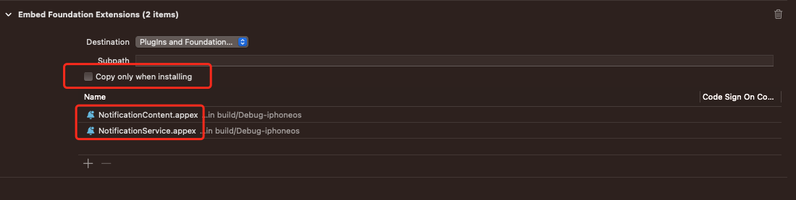

# HYEYE

[](https://travis-ci.org/author/HYEYE )
[](https://cocoapods.org/pods/HYEYE)
[](https://github.com/author/HYEYE/blob/701ff106db3caa805f9dab12df7749c03c889c47/LICENSE)
[](https://cocoapods.org/pods/HYEYE)

## 摘要

HYEYE 组件主要用于：

- 1
- 2

## 集成

```shell
pod 'HYEYE', '~> x.x.x'
```

## 调用

### 引用

- objc

  ```objc
  #import <HYEYE/HYEYE-Swift.h>
  ```

- swift

  ```swift
  import HYEYE
  ```

### 调用接口

- objc
  ```objc
  //objc 代码
  ```

- swift

  ```swift
  //siwft 代码
  ```

## 警告⚠️ 

- 本工程依赖使用xcodegen + xcconfig来管理配置
- 本工程配置了多套config用于对应不一样的target, 这样才能适配于cocoapods 做的组件化开发
- target 配套对应的config，才能编译正确的包
- 由于xcode的问题，app extension不能定义不同的product name

  原因如下：
    - 工程默认会不勾选 copy only when installing
    - build的时候，会执行 copy appextension动作
    - 这里 .appex 的名字在各个config中必须统一，否则会在 copy app extension动作时候，报找不到file的错误。

      如图：
      

## 历史版本

- [1.0.0](http://github/author/HYEYE/tag/1.0.0)

    - 初始化版本
    - 提供： xxx， xxx 功能

- [1.0.1](http://github/author/HYEYE/tag/1.0.1)

    - 修复
    - 提供： xxx， xxx 功能

